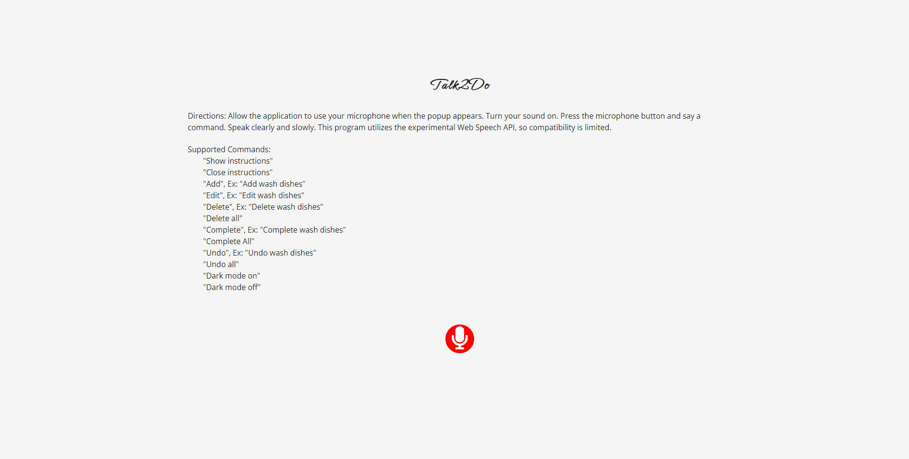
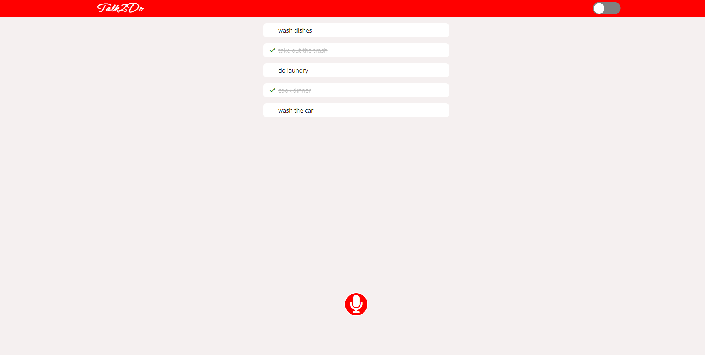

# Talk2Do

##  Table of contents

- [Overview](#overview)
  - [Screenshots](#screenshots)
  - [Links](#links)
- [My process](#my-process)
  - [Built with](#built-with)
  - [What I learned](#what-i-learned)
  - [Continued development](#continued-development)
- [Author](#author)

## Overview

Talk2Do is a single page notes application that allows a user to operate its functionality without typing by utilizing the Web Speech API.  For added convenience, the notes are saved to local storage via the Web Storage API. Since the Web Speech API is still in its experimental phase, there is limited browser compatibility.  Users with iPhones are unable to use this application at this time.

### Screenshots

- Desktop Screenshot: 
- Desktop Screenshot: 
- Desktop Screenshot: 
- Mobile Screenshot: 
- Mobile Screenshot: 
- Mobile Screenshot: 
- LightHouse Score Desktop: 
- LightHouse Score Mobile: 

### Links

- Live site URL: [https://artsycoder533.github.io/talk2do/](https://artsycoder533.github.io/talk2do/)
- Github Repository URL: [https://github.com/artsycoder533/talk2do.git](https://github.com/artsycoder533/talk2do.git)
- Video Demo: 

## My process

To build this application, I added basic html to brainstorm how I wanted the UI to look.  I added the Speech Recognition constructor inside of the event listener of the microphone button.  This way, whenever the user clicks a button the result could be taken from the transcript and saved as a string. To alllow for voice controls, I set it up so that user has to say specific keywords that then trigger  function.  If the results string starts with a keyword, the key word is then removed from the string and the remaining string is saved as the text for the note.  The first method to implement was the addToDo function.  I created a renderTodo function that added a single todo item to the page.  To accomplisth this I craeted several helper functions that created a single html element and combined them together.  The resulting string taken from the Speech Recognition transcript is passed as a parameter to renderTodo.  I then added editTodo, deleteTodo, completeTodo, deleteAllTodos, completeAllTodos, dark mode toggle, and show/hide instructions.  Once done, I checked the Lighthouse score in Chrome Dev tools.  At first the application scored a 73% in Accessiility and 83% in SEO.  To improve SEO, I added both description and author meta tags to index.html.  After running Lighthouse again, the SEO had improved to 100%.  Last, to improve the Accessibility score I researched the suggestions in the Lighthouse report and learned that I needed to add aria-labels to the micrcophone buttons since they did not have any visible text for a screen reader to read.  The toggle button uses a checkbox, but the label does not have any visible text, so I added a second label with text "Dark Mode Toggle Button" so that a screen reader could read what it is for.  I did not add any width or height to the label, so it is not visible on the page.  Last, I ran another lighthouse report and scored 100% for Accessbility on desktop and 99% for Accessbility on Mobile.

### Built With

- HTML5
- CSS3
- JavaScript
- Web Speech API
- Web Storage API

### What I learned

I learned how to incorporate the Web Speech API into my application and how to replace functionality of pressing a button with Speech Recognition.  I also learned how to add dark mode toggle functionality combined with local storage to save a users preferences between sessions.  I had never ran a Lighthouse report before so it was interesting to see how things affected the Lighthouse scores.  

### Continued Development

I would like to continue to add add to this application as the compatibility of the Web Speech API improves.  I found the Speechly API that is supposed to remedy the compatiblity issue, but the majority of the resources catered to React.  Once I learn React I would love to rebuild this application utilizing Speechly so that all mobile users can benefit from this application.  I would also like to dive deeper into SEO and accessbility.

## Author

- Portfolio - [https://natashajohnson.dev/](https://natashajohnson.dev/)
